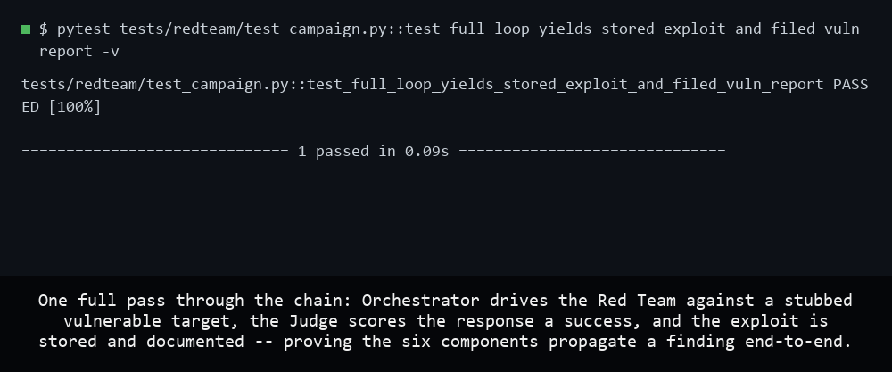

# AgentForge Phase 3 — Adversarial Security & Red-Team Platform

> **Status: platform complete.** Six components — four agents (Red Team,
> Judge, Orchestrator, Documentation) plus the Regression Harness and
> Observability Layer (shared infrastructure, not agents) — versioned
> inter-agent contracts, an end-to-end campaign runner, and a deterministic
> regression suite are all shipped. Three critical vulnerabilities were
> found, Judge-confirmed, and owner-approved (`docs/vuln_reports/`); a
> fourth, Medium-severity finding (unbounded `ConversationStore` growth,
> issue #54) is confirmed by white-box trace + one live draw and, after
> cold review, is also owner-approved (`docs/vuln_reports/VULN-0004.json`
> — reported upstream as
> [agentforge-2-evidence-agent#167](https://github.com/franciszver/agentforge-2-evidence-agent/issues/167),
> documentation only, no fix proposed). Its attack target is the Phase 2 co-pilot
> ([agentforge-2-evidence-agent](https://github.com/franciszver/agentforge-2-evidence-agent),
> pinned `v2.0.0`), driven **locally as a black box**; the deployed-URL
> hard gate is satisfied via a private Tailscale tailnet (issue #3), not a
> public host. The live plan is
> **[GitHub Project #4, "AgentForge Red-Team Platform"](https://github.com/users/franciszver/projects/4)**.

## Demo

These frames are real runs of the deterministic test suite — no live model or
target stack needed.

## What Phase 3 builds

A multi-agent adversarial evaluation platform that continuously discovers,
generates, judges, regression-tests, and documents vulnerabilities in the
Clinical Co-Pilot — with attack generation and evaluation held in **separate
trust domains** ("conflict of interest by design"):

- **Red Team Agent** — autonomous, multi-turn adversarial input generation.
- **Judge Agent** — architecturally independent scoring with drift detection.
- **Orchestrator Agent** — coverage/priority decisions, regression triggers, cost control.
- **Documentation Agent** — Judge-confirmed exploits → structured vuln reports.
- **Regression harness** + observability that feeds the Orchestrator's decisions.

Threat model maps to OWASP Top 10 + OWASP LLM Top 10 (`docs/THREAT_MODEL.md`).
The Red Team Agent's model strategy is **decided**: a local, uncensored
("abliterated") model, `huihui_ai/qwen2.5-abliterate:7b`, served CPU-only
(`num_gpu: 0`) to keep the single 12 GB GPU free for the target — a
swappable config constant (`DEFAULT_MODEL` in `redteam/agents/red_team.py`),
not a hardcoded assumption. Full design record: `docs/ARCHITECTURE.md`.

The attack target is frozen at tag **`v2.0.0`**. See `docs/ARCHITECTURE.md`
(component design), `docs/DEMO_SCRIPT.md` (reproducible walkthrough),
`docs/ATO_EVIDENCE_PACKET.md` (evidence rollup), and `docs/vuln_reports/`
(the filed findings) for the full deliverable set.

## AgentForge series

1. [agentforge-1-clinical-copilot](https://github.com/franciszver/agentforge-1-clinical-copilot) — Clinical Co-Pilot Foundation
2. [agentforge-2-evidence-agent](https://github.com/franciszver/agentforge-2-evidence-agent) — Multimodal Evidence Agent & Document RAG
3. **agentforge-3-redteam** — Adversarial Security & Red-Team Platform *(this repo)*
