# Platform Architecture — AgentForge Phase 3 Red-Team

- **Status:** Final for P3.5 (issue #6).
- **Scope:** the platform that *drives* the attacks described in
  `docs/THREAT_MODEL.md` against the Phase 2 co-pilot — not the target
  itself. The live prototype already built in P3.4 (`evals/agent_prototype.py`)
  is a scoped-down instance of the loop this document describes in full; see
  §7 for exactly which parts it prototypes and which it does not.
- **What this document is not:** it does not present issues #19, #20, or #25
  as confirmed vulnerabilities. The P3.4 suite reproduced #19 and #20 live,
  deterministically, and recorded a new under-determined DoS observation
  (#25) — those reproductions are real and logged in `prd/DECISIONS.md`, but
  severity/confirmation is a P3.13 (vulnerability-report) decision, not one
  made here. (#25 is since resolved — see TRI-013 in `docs/TRIAGE_LAB.md`
  and `docs/ISSUE_25_DOS_CANDIDATE_RESOLUTION.md`: dismissed-with-evidence,
  narrowly, for the `MAX_QUERY_CHARS` retrieval-hop hypothesis only. That
  resolution also surfaced a limitation in this PR's own fix, tracked open
  at issue #55: `Orchestrator._pick_next_case` never emits `case_id` in the
  live loop, so the exact-probe suppression branch it adds is unreachable
  live — a live campaign can still auto-file a `denial_of_service` report
  for a novel overlong-query payload.)

## 1. Prose summary (~500 words)

The platform is six components split across two trust zones so that no
single process can both attack the target and grade its own attack.
**Zone A (adversarial)** holds only the **Red Team Agent**: it generates
novel probes against the target — chat messages, document-upload payloads,
multi-turn sequences — and mutates partial successes into variants. It runs
autonomously; nothing prompts its next attempt. **Zone B (evaluative)** holds
the **Judge Agent**, the **Orchestrator Agent**, and the **Documentation
Agent**, plus two shared services that back all three: the **Regression &
Validation Harness** (a versioned, queryable exploit database) and the
**Observability Layer** (coverage, pass/fail trend, cost, per-agent action
log). The Judge never sees the Red Team's reasoning or prompt history — only
the target's response to a given probe — and the Red Team never sees the
Judge's verdicts beyond a pass/fail/partial signal relayed through the
Orchestrator. That separation is architectural, not cosmetic: each Zone-A and
Zone-B role runs as its own OS process with its own local model instance and
its own context window, so a compromised or manipulated Red Team session has
no channel back into how its own output gets scored.

The Orchestrator sits at the hub. It reads Observability state (which OWASP
categories are under-covered, which findings are open at high severity,
which regression runs are due) and Regression Harness state (has this exact
exploit shape been seen and fixed before), and on that basis decides what the
Red Team attacks next, when a category counts as "sufficiently covered,"
when to trigger a full regression sweep, and how to throttle draws against
the target's single-GPU, ~0.15 req/s ceiling. The Red Team sends probes to
the target and returns raw responses; the Judge independently scores each
response against the case's success criteria and flags drift candidates; the
Orchestrator relays Judge verdicts back to the Red Team as a bare signal (not
a rationale) and writes confirmed results to the Regression Harness. Only
Judge-confirmed exploits reach the Documentation Agent, which turns them into
structured vulnerability reports — ID, severity, clinical impact, minimal
repro, observed-vs-expected, remediation, fix-validation status — reproducible
by an engineer with zero platform context. Any report scored critical-severity
stops at a human-approval gate before it is filed; nothing critical publishes
itself.

The Regression Harness and Observability Layer are shared infrastructure, not
agents: the harness is the system of record for "was this seen before, is it
back," and observability is the system of record for "where does the
Orchestrator's attention go next." Both feed the Orchestrator's decisions
directly — a design point the required-components list is explicit about —
not just human dashboards, which is what makes the Orchestrator's coverage
and regression decisions data-driven rather than a fixed script. Versioned
inter-agent contracts (request/response schemas, typed error shapes) formalize
every arrow in the diagram below and are specified in full in P3.12
(`/contracts`); this document names the arrows, P3.12 types them.

(≈500 words)

## 2. Interaction diagram

```mermaid
flowchart LR
    subgraph ZoneA["Zone A — Adversarial (isolated process/context)"]
        RT["Red Team Agent<br/>(abliterated Qwen, qwen2.5-abliterate:7b, local)"]
    end

    subgraph Target["Attack Target"]
        T["Phase 2 Clinical Co-Pilot<br/>(agentforge-2-evidence-agent v2.0.0)"]
    end

    subgraph ZoneB["Zone B — Evaluative (separate isolated processes/contexts)"]
        J["Judge Agent<br/>(local instruct model)"]
        O["Orchestrator Agent<br/>(local instruct model)"]
        D["Documentation Agent<br/>(local instruct model)"]
    end

    subgraph Shared["Shared services (feed the Orchestrator, not just dashboards)"]
        RH["Regression & Validation Harness<br/>(versioned exploit DB)"]
        OBS["Observability Layer<br/>(coverage, cost, trend, action log)"]
    end

    RT -- "probe: /chat, upload, multi-turn sequence" --> T
    T -- "raw response" --> RT
    T -- "raw response (independent read)" --> J
    J -- "verdict: success / fail / partial / regression<br/>+ drift-check signal" --> O
    O -- "attack directive: category, budget, next case" --> RT
    O -- "trigger full-suite run" --> RH
    RH -- "known-exploit shapes, prior results" --> O
    RH -- "regression trend, reappearance alerts" --> OBS
    OBS -- "coverage gaps, open high-sev, cost/rate state" --> O
    J -- "confirmed-exploit record" --> RH
    RH -- "confirmed exploit + repro" --> D
    D -- "structured vuln report" --> HG["Human approval gate<br/>(critical severity only)"]
    HG -- "approved" --> Filed["Filed vuln report"]

    style ZoneA fill:#3b1f1f,stroke:#e05252,color:#f5e5e5
    style ZoneB fill:#1f2a3b,stroke:#5289e0,color:#e5edf5
    style Shared fill:#1f3b2a,stroke:#52e089,color:#e5f5ec
```

The diagram's load-bearing property: **there is no edge directly from the Red
Team Agent to the Judge Agent, the Orchestrator, or the Documentation
Agent.** The only thing Zone B ever sees of Zone A's activity is what the
target itself did in response to a probe — read independently by the Judge
from the target's own output, not relayed by the Red Team. Conversely the
Red Team only ever receives an Orchestrator-relayed directive, never the
Judge's reasoning. This is what "architectural independence" means here: the
boundary is process and context isolation, enforced by which service can
open a connection to which, not a prompt instruction telling one role not to
peek at another's context.

## 3. The six required components

1. **Red Team Agent.** Generates novel adversarial inputs against the six
   `docs/THREAT_MODEL.md` categories, mutates partial successes into
   variants (e.g. an authz probe that got a 403 tries an indirect patient
   reference next), and runs multi-turn attack sequences. Fully autonomous
   within an Orchestrator-set budget — no human prompts the next attempt.
   Runs in Zone A, isolated from every Zone-B process.

2. **Judge Agent.** Architecturally independent from the Red Team (separate
   process, separate model instance, separate context — never shares a
   context window or prompt history with Zone A). Scores each target
   response as success / fail / partial / regression against the originating
   case's defined success criteria, with a documented drift-detection method
   (§6) protecting scoring consistency over time.

3. **Orchestrator Agent.** Reads Observability and Regression Harness state,
   decides what the Red Team attacks next and when a category is "covered,"
   triggers regression runs, and manages cost/rate limits against the
   target's GPU-serialized throughput ceiling. The only component with a
   directive-sending edge into Zone A.

4. **Documentation Agent.** Converts Judge-confirmed exploits into structured
   vulnerability reports (ID, severity, clinical impact, minimal repro,
   observed-vs-expected, remediation, fix-validation status) that a fresh
   engineer can act on without platform context. A human-approval gate sits
   between this agent and filing any critical-severity report — nothing
   critical self-publishes.

5. **Regression & Validation Harness.** The system of record: a versioned,
   queryable exploit database, auto-run on Orchestrator trigger, that detects
   both a previously fixed vulnerability reappearing and a cross-category
   regression introduced by an unrelated fix. Feeds prior-result context back
   to the Orchestrator so it doesn't re-attack a settled case from scratch.

6. **Observability Layer.** Answers coverage-by-category, pass/fail over
   target versions, resilience trend, open/in-progress/resolved counts, cost
   and cost-scaling rate, and a per-agent action log. Feeds the
   **Orchestrator's decisions** directly (its coverage-gap and open-high-sev
   signals are read programmatically, not just rendered for a human), in
   addition to being a human-facing dashboard.

## 4. Fully-local model strategy (decided)

The owner's decision, locked in `planning/PLAN.md` and reaffirmed here as
settled: **local-only, no cloud, for every one of the four AI roles.** No
role calls a hosted API; nothing target-adjacent leaves the local network
boundary — consistent with the target itself being a zero-PHI-egress,
no-internet clinical appliance.

- **Red Team Agent generator:** **abliterated Qwen**
  (`huihui_ai/qwen2.5-abliterate:7b`), served locally. This is the one role
  that structurally *needs* an uncensored model —
  stock instruct models refuse offensive-security generation outright, which
  would silently cap the attack suite's coverage at whatever a safety-tuned
  model is willing to write. The abliterated model must run **CPU/RAM-resident,
  or GPU-bracketed against the target's inference window** — it must **never
  be co-loaded on the 12 GB card at the same time as the target's own 8B-Q5
  model**. That combination is a documented GPU-contention hazard on this
  hardware (`prd/DECISIONS.md`, 2026-07-19: a prior unrelated co-load caused a
  host BSOD, root-caused to GPU contention, and `OllamaPrewarm` was disabled
  for the remainder of the project on that basis). The Red Team process and
  the target process are therefore scheduled to never both hold GPU residency
  at once, not merely logically isolated.
- **Judge / Orchestrator / Documentation:** three separate local
  instruction-tuned model instances, each in its own isolated process and
  context. None needs to be uncensored — judging, planning, and report-writing
  are not adversarial-generation tasks — so stock instruct models are
  appropriate and lower-risk than the Red Team's abliterated model.
- **Feasibility is validated, not assumed, at the start of P3.6 (Build).**
  This document commits to the *role* (local, uncensored, isolated) and
  treats the *specific model* (abliterated Qwen) as configuration to be
  measured against refusal rate and attack quality before the Red Team Agent
  is built out. If that model underperforms, the safety and independence
  invariants in §3 and §2 hold regardless of which model fills the Red Team
  role — swapping the model is a configuration change, not an architecture
  change: it is set by `DEFAULT_MODEL` in `redteam/agents/red_team.py`, a
  single overridable constant. An abliterated Gemma-3 GGUF was evaluated
  first and ruled out at load time — its `token_embd` tensor shape was
  incompatible with the installed ollama version — which is what led to
  qwen2.5-abliterate as the shipped default.

## 5. Build-vs-configure decision record

The question is not "could an existing tool do part of this" — several
could — it is whether configuring existing tools satisfies the platform's
actual requirements: a genuinely independent Judge, a regression database
that an Orchestrator reads to make coverage decisions, and observability that
*feeds* those decisions rather than only rendering them for a human. None of
the candidates below provide that loop; each is evaluated on its own terms.

| Tool | What it's built for | Why it doesn't replace this platform |
|---|---|---|
| **Garak** (LLM red-team framework) | Automated probe/detector pairs against an LLM endpoint, largely assuming a hosted or locally-served *bare* model behind a known API shape. | No concept of Judge/Red-Team process independence (its probes and detectors run in one process), no Orchestrator reading coverage state to direct the next attack, no regression DB, no notion of a citation/verification trust layer — the target's actual attack surface (`SourceRef` vs `DocumentCitation` asymmetry, patient-binding tool guards, document-ingestion composition) is bespoke and off-map for a generic LLM-probe tool. Garak-style probes are a reasonable *seed source* for Red Team case ideas, not a substitute for the platform. |
| **Burp Suite / OWASP ZAP** (web pentest) | HTTP-layer attack surface: injection, auth, session handling, at the request/response level. | The target's most valuable surfaces are semantic, not syntactic — a topically-irrelevant `SourceRef` passing verification, a document fact composed into a reasoning prompt, a planner substituting the wrong tool. A proxy-and-scanner architecture has no model of "is this citation topically relevant" or "did the planner call the tool it should have." Also cloud/plugin-ecosystem-oriented by default, in tension with the fully-local, no-egress thesis. |
| **Semgrep** (SAST) | Static pattern-matching over source code. | Finds a different class of bug entirely (unsafe patterns in code as written), not runtime LLM-agent behavior under adversarial input. Genuinely useful as a *complementary* CI check on the platform's and the target's own code, but it cannot generate an adversarial `/chat` probe, judge a citation's semantic support, or detect a scoring drift — it has no runtime loop at all. |
| **Commercial red-team platforms** | End-to-end managed adversarial-testing SaaS. | Cloud-hosted or cloud-dependent by construction — disqualified outright by the fully-local, no-egress requirement, since the target itself must never have PHI-adjacent traffic leave the local boundary and the red-team traffic touches the same appliance. Even where a self-hosted tier exists, none is scoped to this target's bespoke trust model (citation-verification asymmetry, patient-binding dual-guard, dev-token-bridge default) — genuinely independent Judge-vs-Generator separation and an Orchestrator-readable regression DB are not off-the-shelf features of any commercial platform surveyed for this decision. |

**Framework choice: custom orchestration, not LangGraph/CrewAI/AutoGen.**
Consistent with Phase 2's committed no-LangGraph decision, the same reasoning
applies here with more force: this platform's core requirement — process-level
Judge/Red-Team isolation as a *security property*, not a workflow convenience
— sits below what any of those frameworks are designed to guarantee. All
three assume a single orchestrating process coordinating in-process agent
objects or lightweight thread/task boundaries; none treats "agent A must not
be able to read agent B's context even in principle" as a first-class
constraint, because their target use case is collaborative multi-agent
composition, not adversarial separation of duties. Adopting one would mean
either fighting the framework to enforce real process isolation anyway, or
quietly downgrading the independence requirement to "separate prompts in one
process" — the exact failure mode the brief calls out by name. A
dependency-light, stdlib-plus-pytest custom orchestrator (already the pattern
established in `evals/`) keeps the attack surface small, keeps every
inter-agent boundary auditable by reading the code that enforces it, and adds
zero third-party supply-chain exposure to a platform whose own job is finding
supply-chain-adjacent and trust-boundary failures in someone else's system.

## 6. AI-use disclosure

| Role | What it does | Independently verified | Taken on trust | Residual risk |
|---|---|---|---|---|
| **Red Team Agent** | Generates and mutates adversarial probes against the target. | Every probe it sends and every raw target response is recorded (`evals/recordings/`) and independently re-readable by the Judge and by a human; the *fact* that a probe was sent and what the target returned is fully verifiable evidence, not the Red Team's self-report. | The Red Team's own internal reasoning for *why* it chose a given mutation is not verified — the platform does not require it to be, only its output. | A creative-but-off-target generator wastes Orchestrator budget on low-value probes without necessarily failing loudly; mitigated by Observability's coverage/cost tracking, which the Orchestrator reads to redirect. |
| **Judge Agent** | Scores each target response success/fail/partial/regression. | Verdicts are checked against the case's own rule-based/example-anchored success criteria at write time, and against a gold-labeled probe set on the drift-detection cadence below. | The Judge's score on a genuinely novel, non-gold-set case is not independently re-verified in real time — that would require a second judge, which the architecture does not currently fund. | A drifting or manipulated Judge could under- or over-report vulnerabilities; §6 drift method below is the primary control, plus human review at the Documentation Agent's critical-severity gate as a second check on the highest-stakes verdicts. |
| **Orchestrator Agent** | Directs the Red Team, decides category coverage, triggers regressions, manages budget. | Its decisions are logged in the per-agent action log (Observability), so every directive is traceable to the state (coverage/cost/regression data) that produced it. | The *quality* of its coverage-sufficiency heuristic is not independently validated beyond human spot-review of the action log — no second orchestrator cross-checks its decisions. | A miscalibrated "covered" threshold could stop attacking a category too early; caught by human review of Observability's coverage report before a category is signed off in a report. |
| **Documentation Agent** | Converts Judge-confirmed exploits into structured vulnerability reports. | Every report is checked against the Regression Harness's confirmed-exploit record it was generated from (data-quality constraints validated pre-write: unique IDs, required fields, no duplicate attack-sequence entries) and reproduced by re-running the minimal repro. | Report prose (clinical-impact framing, remediation wording) is not independently re-derived — only the underlying facts (ID, repro, observed-vs-expected) are checked against the source record. | A well-formed but misleadingly framed report could over- or under-state impact; the human-approval gate on critical-severity filings is the control, and non-critical reports are reviewed at P3.13 packaging. |

**Judge drift-detection + correction method (concrete definition).** The
Judge is periodically re-scored, not just trusted to hold steady: a **fixed,
version-controlled gold-labeled probe set** (a held-out subset of the P3.4/6
attack cases, each with an expected verdict) is re-run through the Judge
on every Orchestrator-triggered full regression sweep.
(Clarification: a gold label records the **expected output of the scoring
pipeline given that case's own `detect()`**, not necessarily a human
judgement of exploitability. `gold-dos-guard-not-held`, for instance, keeps
`expected_outcome="success"` even though issue #25's white-box trace
resolved that specific probe as a documented false positive
(`docs/TRIAGE_LAB.md` TRI-013) — flipping the gold label to match the
false-positive verdict would make the drift check fire on every run and
would assert something false about what `detect()` itself returns for that
input. The gold set's job is to catch the Judge disagreeing with the
pipeline's own deterministic behavior, not to encode a human exploitability
verdict.) The Judge's score on each gold case is compared to its recorded
prior score and to the gold label; if the Judge's **agreement rate with the
gold labels drops below a fixed threshold (95%, i.e. it disagrees with the
gold-set verdict on more than 1 in 20 gold cases)**, or if its score on
**any individual gold case flips from its previous run's score**, the sweep
is flagged `judge_drift_suspected` in Observability and the Orchestrator
halts new attack directives until a human reviews the flagged cases —
correction is a human decision (re-anchor the Judge's prompt/criteria against
the gold set, or roll back the Judge model version), not an automatic
re-tuning, so a drifting Judge cannot silently correct itself into a
different, unreviewed scoring standard. This threshold and the gold-set
contents are versioned alongside the inter-agent contracts (P3.12) so a
threshold change is itself an auditable, reviewed diff.

## 7. Relationship to the P3.4 prototype

`evals/agent_prototype.py` already runs live, end-to-end, against the target
and is explicitly scoped in its own docstring and `evals/README.md` as a
prototype of **only** the Red-Team-generates → Judge-scores loop, using a
**scripted generator** (a fixed case list, `ALL_CASES`) in place of the
uncensored-model Red Team Agent, and a **rule-based judge** (each case's own
`detect` predicate) in place of the independent Judge Agent described in §3.
It does not yet include an Orchestrator, a Documentation Agent, a Regression
Harness, or an Observability Layer — those are P3.6 onward. The prototype's
value here is that it proves the *mechanics* (live target driving, SSE
parsing, record-per-draw honesty discipline) the full platform depends on;
it is not a shortcut standing in for the model-driven generator or the
architecturally independent Judge, both of which remain P3.6/P3.7 work.

## 8. ACL-ON vs ACL-OFF primary target — recommendation

The issue's Done-when list calls for this decision to be made and logged;
per this session's process rules the decision is **recommended here, logged
by the orchestrator**, not written into `prd/DECISIONS.md` by this agent.
Recommendation: **ACL-OFF is the primary target configuration.** It is the
shipped default (`copilot_per_user_token_enabled=False`), so it is what an
actual deployment exposes to an actual attacker without any special setup —
the highest-external-validity configuration to spend the bulk of the suite's
budget on. ACL-ON should still get a bounded pass (attacking
`detect_foreign_patient_reference` and `enforce_patient_binding`
independently, per `docs/THREAT_MODEL.md` §2.6) because "the control exists
and was defeated/held" is itself informative, but as a secondary run whose
budget does not compete with the ACL-OFF suite's coverage.

## 9. Inter-agent contracts

Versioned request/response schemas and typed error contracts (target
unreachable, budget exceeded, judge timeout, no-findings-in-window,
regression detected) for every edge in §2's diagram are specified in full in
**P3.12** (`/contracts`, JSON Schema, v1 minimum, contract tests on both
sides). This document names and justifies the edges; it does not duplicate
their schemas.
